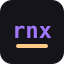

<p align="center">
  
</p>

<h1 align="center">Rasmalai (<code>rnx</code>)</h1>

<p align="center">
  <a href="https://github.com/rovelstars/rasmalai/actions/workflows/ci.yml"></a>
  <a href="https://github.com/rovelstars/rasmalai/stargazers"></a>
  <a href="http://discord.rovelstars.com/server"></a>
</p>

<p align="center">
  <a href="https://rasmalai.rovelstars.com/manual/01-lexicon-and-structure">Documentation</a>
  ·
  <a href="https://github.com/rovelstars/rasmalai/issues">Issues</a>
  ·
  <a href="https://rasmalai.rovelstars.com">Website</a>
  ·
  <a href="https://rasmalai.rovelstars.com/packages">View packages</a>
</p>

## What is Rasmalai?

Rasmalai is a high-performance compiled programming language. It pairs
TypeScript-like developer ergonomics with native C-ABI interop, a
multi-pass LIR optimizer, a Cranelift JIT for fast dev cycles, and an
LLVM AOT backend for release builds. One toolchain covers scripting,
native binaries, and a browser playground.

## Why does it exist?

Mainstream systems languages force a choice: ergonomics or control.
Rasmalai refuses it — memory safety through ARC with explicit cyclic
edges instead of a garbage collector, Python-grade readability with
native execution speed, and a standard library that treats files,
sockets, threads, and SIMD as first-class citizens rather than FFI
afterthoughts.

## Install

Linux and macOS (installs into `~/.local/bin` by default, honors
`$XDG_BIN_HOME` when set):

```bash
curl -fsSL https://rasmalai.rovelstars.com/install.sh | sh
```

Windows (PowerShell, installs into `%LOCALAPPDATA%\rnx` by default):

```powershell
irm https://rasmalai.rovelstars.com/install.ps1 | iex
```

Pin a version, or install elsewhere:

```bash
curl -fsSL https://rasmalai.rovelstars.com/install.sh | sh -s -- v0.1.0
curl -fsSL https://rasmalai.rovelstars.com/install.sh | sh -s -- --prefix /usr/local
```

```powershell
& ([scriptblock]::Create((iwr https://rasmalai.rovelstars.com/install.ps1).Content)) -Version v0.1.0
```

Build from source (needs Rust stable and LLVM 22):

```bash
cargo build --release
```

The binary lands at `./target/release/rnx`.

Upgrade by re-running the same command you installed with — running it
again with no version argument always moves you to the latest release:

```bash
curl -fsSL https://rasmalai.rovelstars.com/install.sh | sh
```

```powershell
irm https://rasmalai.rovelstars.com/install.ps1 | iex
```

## Use

Run a script (JIT, dev mode):

```bash
rnx run path/to/main.rnx
```

Compile a native binary ahead of time (LLVM, release mode):

```bash
rnx build path/to/main.rnx
```

Program arguments go after `--`:

```bash
rnx run path/to/main.rnx -- arg1 arg2
```

Run the test suite:

```bash
cargo test --workspace
```

Try it without installing anything: the
[playground](https://rasmalai.rovelstars.com/playground) runs the
language in your browser.

## Roadmap

- **Accounts and package management server integration**, so the
  registry can serve publish, yank, ownership, and access-control
  requests instead of org-token-only seeding.
- **Native cross-platform UI**, so Rasmalai programs can ship graphical
  interfaces on every supported OS from one codebase.

## How to contribute

Issues and pull requests are welcome at
[rovelstars/rasmalai](https://github.com/rovelstars/rasmalai/issues).
Open an issue describing the problem or proposal first for anything
beyond a trivial fix, then send a PR against `main`. Every compiler
change needs tests; every user-facing change needs docs.

## Layout

- `compiler/` — the language itself: lexer, parser, semantic analysis,
  LIR lowering and optimization, interpreter, Cranelift JIT, LLVM AOT,
  native C-ABI runtime, and the `rnx` CLI.
- `examples/` — reserved for language samples (currently empty).
- `tools/rnx-bindgen/` — C-header binding generator written in pure
  `.rnx`. Turns system headers (zlib, sqlite3) into Rasmalai modules.
- `benches/` — performance and scaling benchmarks.
- `editors/` — Helix, Neovim, VSCode, and Zed extensions.
- `website/` — SvelteKit documentation and interactive playground.

## License

Dual-licensed, at your option: MIT OR Apache-2.0. See `LICENSE`.
